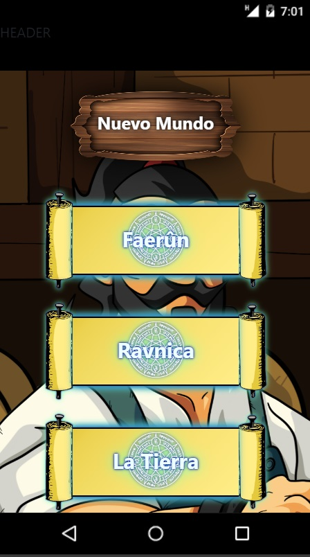

### Mundos de Bolsillo

Una aplicación para poder tener organizada la información de tus partidas de rol.

  <summary>Contenido 📝</summary>
  <ol>
    <li><a href="#objetivo-🎯">Objetivo 🎯</a></li>
    <li><a href="#sobre-el-proyecto-🔎">Sobre el proyecto  🔎</a></li>
    <li><a href="#deploy-🚀">Deploy 🚀</a></li>
    <li><a href="#stack">Stack</a></li>
    <li><a href="#instalación-en-local">Instalación en local</a></li>
    <li><a href="#vistas">Vistas</a></li>
    <li><a href="#futuras-funcionalidades">Futuras funcionalidades </a></li>
    <li><a href="#contribuciones">Contribuciones</a></li>
    <li><a href="#webgrafia">Webgrafia: </a></li>
    <li><a href="#agradecimientos">Agradecimientos</a></li>
    <li><a href="#contacto">Contacto</a></li>
  </ol>
</details>

---

## Objetivo 🎯
---
En este repositorio encontrarás lo necesario para correr el front-end de la aplicación, pero para poder usarla en todo su esplendor deberás hacerte con el backend correspondiente en <a href="https://github.com/IgnacioFurio/Mundos_De_Bolsillo-BE">Mundos De Bolsillo BE 🎯</a>.


---
## Sobre el proyecto 🔎
---
Como alguien que dirige partidas de rol he notado que durante las sesiones es muy dificil llevar la cuenta de todo lo que ocurre tanto en mesa como fuera de ella, la información fluye en todas las direcciones y muchas veces se pierde. 

Con esta aplicación busco solucionar los problemas que he ido encontrando tanto como Director de Juego como Jugador de un plumazo;

<li>Un lugar dónde poder tener controlados los elementos de la ambientación tales como los personajes tanto jugadores como no jugadores, y los sitios por donde se mueven.</li>
<li>Registrar de manera instantanea los lugares por dónde pasan, asi como los secretos o pistas que puedan descubrir.</li>
<li>Crear escenas que recojan los elementos de la partida y sus sucesos.</li>
<li>Crear la sesión añadiendo la escenas necesarias.</li>
<li>Al señalar que la sesión ha finalizado poder comprobar que cosas se han visto en la mesa, o cuales se han quedado en el tintero.</li>
<li>Almacenar el registro de esa sesión para que cualquier participante pueda consultarla siempre que lo necesite.</li>


  ---
<!-- ## Deploy 🚀
---
<div align="center">
    🚀🚀🚀<a href=""><strong> Todavía sin deploy</strong></a>🚀🚀🚀
</div>

--- -->
## Stack
---
<div align="center">
<a href="https://www.reactjs.com/">
    
</a>
<a href="https://developer.mozilla.org/es/docs/Web/JavaScript">
    
</a>
 </div>

---
## Instalación en local
---
1. Clonar el repositorio // Clone repository
2. ` $ npm install `
3. ` $ npm run dev `
4. Una vez en la página principal crear la primera partida.
5. Ahora es el momento de poblar esa partida para hacerla sentir viva, recomiendo seguir el siguiente orden; localizaciónes, personajes, secretos y misiones.
6. Hacer las consultas que consideres necesarias.

---
## Vistas
---

Seguimos trabajando en la aplicación para poder enseñar algo más en las próximas semanas.




|||


---
## Futuras funcionalidades
---

⬛ Creación de partidas dónde organizarte la información para cada una de ellas.

⬛ Creación de mundos ligados a partidas.

⬛ Creación de personajes y lugares ligados a los mundos.

⬜ Creación de secretos/pistas y misiones ligados tanto a personajes como a lugares.

⬜ Asociación de lugares dentro de otros como sitios que visitar, ej; el Distrito Norte es un barrio de la ciudad de WaterDeep, ambos son lugares, pero uno lo puedes encontrar dentro de otro.

⬜ Creación de escenas que recojan lo necesario para poder montar el ambiente para la partida.

⬜ Creación de sesiones que recojan las distintas escenas que puede ser que tengan lugar.

---
## Contribuciones
---

Las sugerencias y aportaciones son siempre bienvenidas.

Puedes hacerlo de dos maneras:

1. Abriendo una issue // Open an issue
2. Crea un fork del repositorio // Fork the repository
    - Crea una nueva rama  // Create new branch
        ```
        $ git checkout -b feature/nombreUsuario-mejora
        ```
    - Haz un commit con tus cambios // Make a commit with the changes
        ```
        $ git commit -m 'feat: mejora X cosa'
        ```
    - Haz push a la rama // Push origin your branch
        ```
        $ git push origin feature/nombreUsuario-mejora
        ```
    - Abre una solicitud de Pull Request // Open a Pull Request

---
## Webgrafia:
---

- Repositorios propios

  <a href="https://github.com/IgnacioFurio" target="_blank"></a>
- Documentacion de librerias externas // External libraries official documentation
- Documentación oficial de las tecnologías usadas // Official techs documentation

---
## Agradecimientos: 
---

De momento gracias por haber llegado hasta aquí, espero que pruebes las aplicación cuando este lista, o por lo menos cuando vaya tomando forma.


- ***Datata***
  
  Gracias por no perder la fe en mí, y sobretodo por sequir solucionando esas dudas que me han ido saliendo al vuelo.

  <a href="https://github.com/datata" target="_blank"></a> 


## Contacto // Contact

- ***Ignacio***  
<a href="https://www.github.com/userGithub/" target="_blank"></a> 
<a href = "mailto:bichoifj@gmail.com"></a>
<a href="https://www.linkedin.com/in/ignacio-furi%C3%B3-0a9010233/" target="_blank"></a> 
</p>